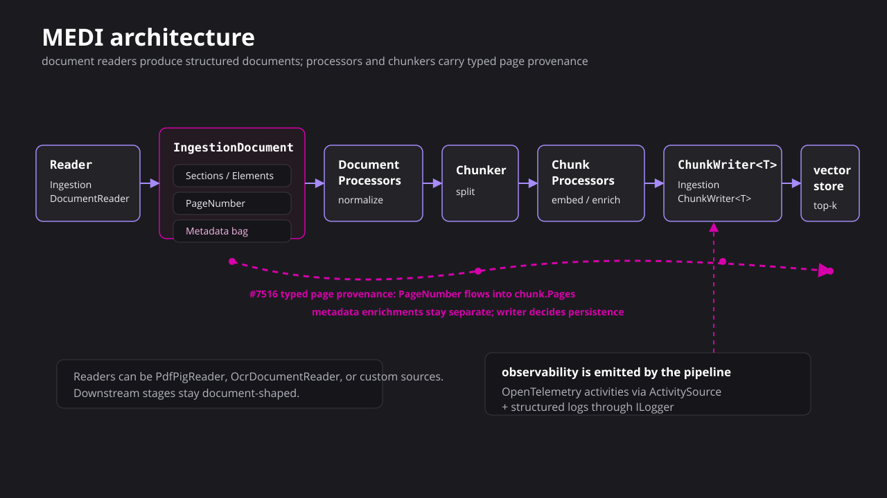
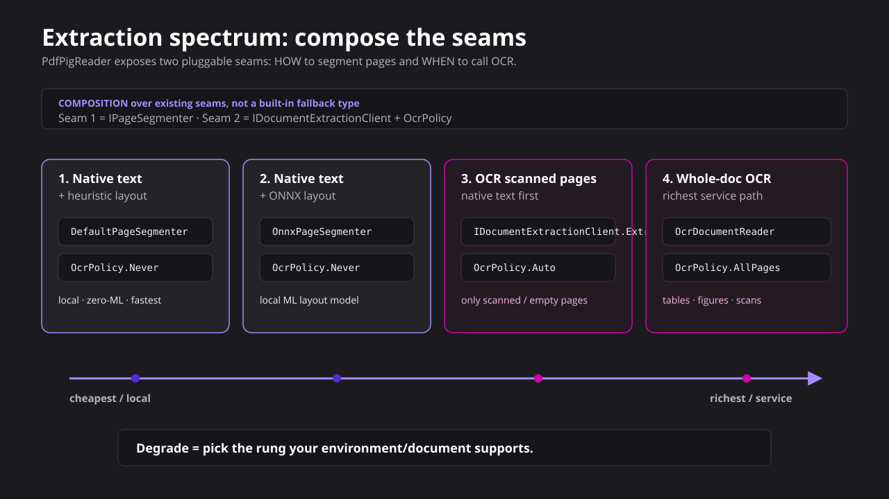
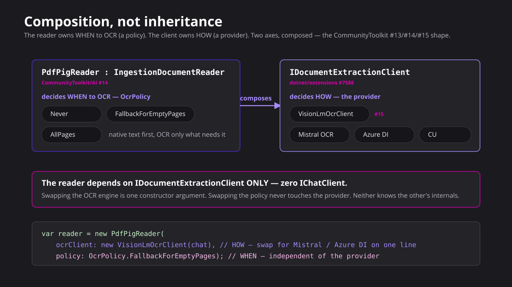

<!--
title: One interface for every OCR engine
subtitle: Provider-neutral document parsing for .NET
speaker: Luis Quintanilla
event: .NET AI building blocks
date: TODO Date
repo: TODO repo URL after publishing
-->

<!-- Message-first deck. Every technical claim is grounded on a real run captured under
     samples/output/, and the samples run on the REAL dotnet/extensions code (preview2 +
     #7588), packed into a local feed, not a vendored copy. The through-line: document parsing is
     fragmented and vendor-locked; a provider-neutral capability (IOcrClient) fixes it; a thin reader
     (OcrDocumentReader) bridges it into the MEDI pipeline; proposed typed page provenance on chunks
     (#7516) makes the answers citable; and the PdfPig reader (CommunityToolkit #14) shows the same
     seam composed a second way. The work spans two repos and five PRs. -->

<div class="title-slide">

<span class="kicker">.NET AI building blocks</span>

# One interface for every OCR engine

<p class="subtitle">Provider-neutral document parsing for .NET</p>

<div class="title-rule"></div>

<p class="byline">Luis Quintanilla</p>

</div>

Note:
Open on the pain every RAG author hits: getting a PDF into clean text is the messiest part of the
pipeline, and today it locks you to one vendor. Promise: one interface, four engines, a real MEDI
pipeline, and a citable answer by the end — all on real preview bits, not a mock.

---

<span class="kicker">Primer · 90 seconds</span>

## What OCR is, and the words we'll use

<div class="cols">
<div class="col-left">

**OCR / document parsing** turns a document's *bytes* — a born-digital PDF, a scan, a photo — into
*structured text*: pages, headings, tables, figures. It's step zero of every document-AI pipeline.

The vocabulary for the rest of the talk:

**extract → structure → chunk → retrieve → answer**

OCR owns the first two. Everything after is the pipeline.

</div>
<div class="col-left callout">

**Two engine archetypes**

- **Document-native** (Mistral OCR, Azure DI, Content Understanding): whole doc in one call → structured pages, tables, figures.
- **Transcribe-by-seeing** (a vision LLM): reads the page like a person → one blob of Markdown.

Same job — different fidelity, latency, cost. One contract serves both.

</div>
</div>

Note:
Ninety seconds of grounding so nobody is lost. Two things to remember: the pipeline vocabulary
(extract, structure, chunk, retrieve, answer) and the two archetypes (document-native vs vision-LLM).
Everything else builds on these.

---

<span class="kicker">Primer · where OCR sits</span>

## From bytes to a cited answer


Note:
This is the map for the whole deck. Left of the dashed line is the OCR capability — bytes to
structured pages, including a first-class figure/image path. Right of it is the MEDI pipeline. The one
small adapter between them is the whole trick. We'll walk this left to right.

---

<span class="kicker">The problem</span>

## Getting a PDF into text is the messy part

<div class="cols">
<div class="col-left">

Every document-AI engine solves the same job and exposes a different API. The moment you pick one,
your pipeline is welded to it.

- Mistral OCR: POST a data URL, read `pages[]`
- Azure Document Intelligence: async-poll an `AnalyzeResult`
- Azure Content Understanding: create an analyzer, poll again
- Vision LLM: prompt a chat model, hope for Markdown

</div>
<div class="col-left callout">

**The promise**

Read the document through one interface. Swap the engine with one line. Carry the page number all
the way to the answer, so every fact is citable.

</div>
</div>

Note:
Name the tax before the fix. Four engines, four wire protocols, four SDKs. Switching engines today is
a rewrite, not a config change. That is the problem worth removing.

---

<span class="kicker">The pattern already exists</span>

## OCR is a capability, not a vendor

<div class="cols">
<div class="col-left">

.NET already turned "talk to a model" into `IChatClient`: one interface, any provider, swap with a
line. Embeddings did it with `IEmbeddingGenerator`.

Reading a document is the same shape of problem. It deserves the same seam — and that seam is
dotnet/extensions **#7588**, in `Microsoft.Extensions.AI`.

</div>
<div class="col-left">

```csharp
public interface IOcrClient : IDisposable
{
    Task<OcrResult> ExtractAsync(
        Stream document,
        string mediaType,
        OcrOptions? options = null,
        IProgress<OcrProgress>? progress = null,
        CancellationToken cancellationToken = default);

    object? GetService(
        Type serviceType,
        object? serviceKey = null);
}
```

</div>
</div>

Note:
This is the proposed shape from dotnet/extensions #7588. Stream in, a normalized OcrResult out. The
GetService escape hatch mirrors IChatClient, so middleware and callers can reach the concrete engine.
Everything in this deck runs on this exact type, packed locally from the real branch.

---

<span class="kicker">The result shape</span>

## One normalized result, whatever the engine

<div class="cols">
<div class="col-left">

```csharp
class OcrResult
{
    IReadOnlyList<OcrPage> Pages;
    string Markdown;      // pages joined, in order
    string? OcrSource;    // which engine
    string? ModelId;
}

class OcrPage
{
    int Index;            // page number
    string Markdown;
    IReadOnlyList<OcrTable> Tables;
    IReadOnlyList<OcrImage> Images;   // figures
    double? Confidence;
}
```

</div>
<div class="col-left callout">

Every engine normalizes onto this. The page `Index` is the detail that makes citations possible
later, so it is a first-class field, not an afterthought in a metadata bag.

</div>
</div>

Note:
Keep this slide short. The one field to point at is OcrPage.Index. It is the thread we pull all the
way through the reader and the chunker to the citation.

---

<span class="kicker">The result grows with the engines</span>

## Figures and a URL entry point — validated, then proposed

<div class="cols code-output">
<div class="col-left">

```csharp
// IncludeImages -> OcrPage.Images, populated
// across BOTH document-native engines:
var r = await ocr.ExtractAsync(stream, type,
    new OcrOptions { IncludeImages = true });

foreach (var img in r.Pages[0].Images)
    Save(img.Content,      // rendered bytes
         img.BoundingRegion,
         img.Caption);     // may be null

// symmetric with the DataContent overload:
await ocr.ExtractAsync(new UriContent(uri));
```

</div>
<div class="col-left">

<div class="output">
<span class="output-label">captured output</span>

```text
mistral-ocr: 1 image  bbox+bytes (28KB jpeg)
azure-di:    3 figures bbox+bytes; one caption
  "Figure 1. Map showing the four
   continuous assessment units (AUs)..."
UriContent (data:) -> same OcrResult
```
</div>

</div>
</div>

<div class="slide-actions">
<span class="run">dotnet run 09-images-and-uris.cs -- data/usgs-petroleum-assessment.pdf</span>
</div>

Note:
Prototype-first. `OcrImage` (nullable Content) + `OcrPage.Images` validated across two document-native
engines — Mistral returns inline image bytes, Azure DI returns cropped figure bytes plus a caption — and
degrades to caption-only for a vision LLM that can't emit bytes. That cross-provider evidence is what
earns the change a place *in* the #7588 proposal, not just the demo. The UriContent overload is the
symmetric partner to the shipped DataContent one. Details in docs/api-notes.md.

---

<span class="kicker">The payoff</span>

## Four engines. Four protocols. One loop.

<div class="cols code-output">
<div class="col-left">

```csharp
IOcrClient[] clients =
[
    new VisionLlmOcrClient(chat),
    new FoundryMistralOcrClient(foundry, cred),
    new AzureDocumentIntelligenceClient(di, cred),
    new ContentUnderstandingClient(cu, cred),
];

foreach (var client in clients)
{
    // identical call for every engine
    var r = await client.ExtractAsync(stream, "application/pdf");
    Report(r.OcrSource, r.Pages.Count);
}
```

</div>
<div class="col-left">

<div class="output">
<span class="output-label">captured output</span>

```text
provider                       pages tables  chars
-------------------------------------------------------
vision-llm (gpt-4.1-mini)          1      0  13266
mistral-ocr                        2      0  12657
azure-document-intelligence        2      3  14847
azure-content-understanding        2      0  14773
```
</div>

</div>
</div>

<div class="slide-actions">
<span class="run">dotnet run 05-one-loop-four-clients.cs</span>
</div>

Note:
This is the whole point. The construction lines are the only provider-specific code. The loop never
changes. Real run on the complex USGS fact sheet, four live engines, keyless. Two even come from
Microsoft: DI and Content Understanding, unified behind the same seam. Same PDF, same call — yet the
engines diverge: Azure DI recovers 3 native tables where the others return none, and the vision LLM
collapses the two pages into one transcribed blob. Same interface, different fidelity; the caller
chooses.

---

<span class="kicker">Two archetypes</span>

## The seam covers both kinds of engine

<div class="cols">
<div class="col-left">

**Document-native** (Mistral OCR, Azure DI, Content Understanding)

- Whole PDF in one call, structured pages out
- Native tables, confidence, page model
- 2 pages back from a 2-page PDF

</div>
<div class="col-left">

**Transcribe-by-seeing** (vision LLM)

- Reads the page visually, one blob of Markdown
- No native page model or tables
- 1 "page" back, higher variance

</div>
</div>

The run above shows the difference in one table: 2 structured pages versus 1 transcribed blob. Same
interface, so your pipeline chooses on fidelity and cost, not on API shape.

Note:
Vision is not a document reader; it is a fallback transcriber. Putting it behind the same contract is
honest because the caller can pick it deliberately, and swap it out just as easily.

---

<span class="kicker">The vision path, leveled up</span>

## Structured output — without genericizing the interface

<div class="cols code-output">
<div class="col-left">

```csharp
// opt in: ask the vision model for
// OcrResult-shaped JSON, not prose
var opt = new OcrOptions {
  AdditionalProperties = {
    ["vision.structured"] = true } };
var r = await visionOcr.ExtractAsync(s, type, opt);
// -> pages, language, confidence, tables

// arbitrary typed extraction = composition,
// reach the inner client, don't grow IOcrClient
var chat = visionOcr.GetService<IChatClient>();
var summary = await chat
    .GetResponseAsync<DocumentSummary>(text);
```

</div>
<div class="col-left">

<div class="output">
<span class="output-label">captured output</span>

```text
structured=OFF -> 1 page,  tables=0 figures=0  lang=? conf=?
structured=ON  -> 1 page,  tables=0 figures=1  lang=en conf=0.98
  (falls back to freeform if unsupported)

typed POCO (OCR-then-extract):
  title: "Assessment of Continuous Oil and Gas
    Resources of the Timan-Pechora Basin
    Province, Russia, 2018"
  keyPoints: [ 1.4B bbl shale oil; 46 Tcf gas;
    four continuous assessment units; ... ]
```
</div>

</div>
</div>

<div class="slide-actions">
<span class="run">dotnet run 11-vision-structured-output.cs</span>
</div>

Note:
MEAI ships first-class structured output (GetResponseAsync&lt;T&gt; + ForJsonSchema&lt;T&gt;). Two
provider-neutral patterns: (1) opt-in structured *transcription* inside the vision client — it asks for
OcrResult-shaped JSON and gracefully degrades to freeform when the model can't honor a schema; (2)
arbitrary typed *extraction* by composition — expose the inner IChatClient via GetService, don't add
&lt;T&gt; to IOcrClient. This is our implementation guidance, not a #7588 ask.

---

<span class="kicker">The boundary</span>

## A capability is not a pipeline stage

<div class="cols">
<div class="col-left">

**`IOcrClient` — a capability.** Bytes in, `OcrResult` out. Knows nothing about pipelines. Mistral /
Azure DI / Content Understanding / vision LLM are just providers behind it.

**`IngestionDocumentReader` — a pipeline stage.** The MEDI front door: `ReadAsync(stream, id, type)
-> IngestionDocument`. Knows nothing about *which* engine — or whether OCR is used at all.

</div>
<div class="col-left callout">

**`OcrDocumentReader : IngestionDocumentReader` — the bridge.**

One reader that **composes any `IOcrClient`**, mapping `OcrResult -> IngestionDocument`, carrying
page as `PageNumber`, and stamping `ocr_source` / `confidence` / bbox metadata aligned with `PdfPigReader`.

No per-engine reader. No `VisionOnly` flag. The engine is injected.

</div>
</div>

Note:
This is the question the demo is really about: where does OCR stop and the pipeline begin? IOcrClient
is the capability; IngestionDocumentReader is the stage; OcrDocumentReader is the one small adapter
between them. Draw that line once and every engine drops in without touching the pipeline.

---

<span class="kicker">The whole stack at a glance</span>

## One contract, top to bottom


Note:
A single visual to hold in your head — and the whole argument in one picture. At the base,
`IOcrClient` is a **peer capability** sitting right beside `IChatClient` and `IEmbeddingGenerator`:
OCR earns a seat at the foundation, not a vendor SDK bolted on per app. Above it, everything is
**built on** that base — MEDI's pipeline abstractions, the CommunityToolkit concretes that compose the
contracts, and the Aspire app on top. Solid boxes are components; dashed boxes are notes. Swap any one
box on its row and the rows above and below don't move.

---

<span class="kicker">Where it lives</span>

## Abstractions in the platform, concretes in the toolkit

<div class="stack">

```text
dotnet/extensions          ── ABSTRACTIONS (provider-neutral) ──────────────
  Microsoft.Extensions.AI
    IChatClient · IEmbeddingGenerator
    IOcrClient                         (#7588)  bytes -> OcrResult
  Microsoft.Extensions.DataIngestion (MEDI)
    IngestionDocumentReader                     the pipeline front door
    IngestionDocument / Section / Element  (PageNumber + Metadata)
    Chunkers  ── #7516 proposed: PageNumber -> chunk.Pages (typed list)
    IngestionChunk (Pages + Metadata) -> writer -> vector store

CommunityToolkit/AI        ── CONCRETES (impls, provider/native deps) ───────
    PdfPigReader   (#14)  IngestionDocumentReader: digital text +
                             per-page OCR fallback, composing any IOcrClient
    VisionLMOcrClient (#15)  IOcrClient over a vision IChatClient (closes #13)
    DataIngestion processors (#10)  chunk enrichers
```

</div>

The abstractions never privilege an engine. Every concrete reader and client is a building block on
top — swappable, provider-neutral, no favorites.

Note:
This is the layering answer. The platform ships the neutral seams; the toolkit ships the concrete
engines and readers. IOcrClient and IngestionDocumentReader are abstractions; VisionLMOcrClient and
PdfPigReader are concretes. Nothing in the core knows about Mistral or PdfPig.

---

<span class="kicker">Why the page model matters</span>

## Provenance survives OCR → reader → chunk

<div class="cols code-output">
<div class="col-left">

```csharp
// OcrDocumentReader bridges IOcrClient into MEDI
var reader = new OcrDocumentReader(ocr);
var doc = await reader.ReadAsync(pdf, name, "application/pdf");

// Proposed #7516 shape: typed page provenance on chunks
var chunker = new SectionChunker(new(tokenizer) {
    MaxTokensPerChunk = 256,
});
await foreach (var c in chunker.ProcessAsync(doc, ct))
    // proposed API: c.Pages carries element.PageNumber values
```

</div>
<div class="col-left">

<div class="output">
<span class="output-label">proposed shape</span>

```text
IngestionDocument: 12 section(s), 12 element(s)

#7516 proposed public API:
  IngestionChunk<T>.Pages : IReadOnlyList<int>

chunk cites: pages = [0]
other metadata: ocr_source = mistral-ocr
```
</div>

</div>
</div>

<div class="slide-actions">
<span class="run">proposed #7516 API shape, not in the dev-feed yet</span>
</div>

Note:
A retriever can find the right text and still be unable to say where it came from. #7516 proposes
typed page provenance on the chunk: the chunker gathers `element.PageNumber` into `chunk.Pages`
(`IReadOnlyList<int>`). That API is not in today's dev-feed; the current sample validates the earlier
string-key prototype.

---

<span class="kicker">MEDI, end to end</span>

## Provenance rides the pipeline, not just the reader



Note:
Zoom out from the one reader to the whole MEDI pipeline. OcrDocumentReader is just the first stage; the
#7516 proposal carries typed page provenance through the in-memory stages: document processors, the
chunker, and chunk processors. Page becomes `chunk.Pages`; other enrichment, like `ocr_source`,
`confidence`, and bbox, stays in metadata. The writer still decides what persists to the vector store.
And because it's MEDI, the whole pipeline is instrumented: OpenTelemetry traces and logs fall out for
free, which is exactly what the Aspire hero app surfaces on its dashboard.

---

<span class="kicker">The same seam, a second way</span>

## PdfPig reads native text — and composes OCR

<div class="cols code-output">
<div class="col-left">

```csharp
// #14: one reader, native text first,
// OCR ONLY the pages that need it —
// and the OCR engine is INJECTED.
new PdfPigReader(
    ocrClient: visionLm,           // any IOcrClient
    policy: OcrPolicy.FallbackForEmptyPages);

// OcrPolicy = WHEN to OCR, not WHICH model:
//   Never                 native only
//   FallbackForEmptyPages native + OCR gaps
//   AllPages              whole doc -> IOcrClient
```

</div>
<div class="col-left">

<div class="output">
<span class="output-label">captured output</span>

```text
[Never]      2 pages, 2 elems -> OCR: 0
[Fallback]   2 pages, 2 elems -> OCR: 0
             (all pages were digital)
[AllPages]   2 pages, 2 elems -> OCR: 1

Both readers -> SAME chunker: 17 chunks
```
</div>

</div>
</div>

<div class="slide-actions">
<span class="run">dotnet run 08-pdfpig-reader.cs   # USGS default; pass -- data/survival-kit.pdf for the baseline</span>
</div>

Note:
This is CommunityToolkit #13/#14/#15 in one slide. #14 replatforms the PdfPig reader to compose any
IOcrClient for its per-page OCR fallback; #15 is VisionLMOcrClient, an IOcrClient over a vision chat
model (it closes design issue #13). The reader (#14) composes the client (#15): the boundary in
action. A born-digital PDF needs zero OCR; a scanned page routes to the injected engine — and the
reader depends on IOcrClient only, never a chat model directly.

---

<span class="kicker">The extraction spectrum</span>

## One reader, cheapest-first across the whole range



Note:
The same PdfPigReader spans this whole range — you don't switch types as the document gets harder, you
turn a policy dial. Left end: native text only, zero OCR, near-free — the born-digital case. Middle:
inject a layout model or fall back to OCR only on the empty pages. Right end: hand the whole document to
an IOcrClient for a scanned PDF. Cost and fidelity rise together left to right; the graduation arc from
the survival-kit baseline to the scanned USGS twin is a walk across this axis.

---

<span class="kicker">Two axes, composed</span>

## The reader owns WHEN; the client owns HOW



Note:
The composition picture behind the last slide. WHEN-to-OCR is a policy on the reader; HOW-to-OCR is a
provider behind the client. Two independent axes. The reader depends on IOcrClient only — never a chat
model — so the vision path is just one provider among four, swappable on a single line.

---

<span class="kicker">End to end</span>

## PDF to a cited answer, one pipeline

<div class="cols code-output">
<div class="col-left">

```csharp
using IOcrClient ocr =                 // swap engine
    new FoundryMistralOcrClient(foundry, cred);
var doc = await new OcrDocumentReader(ocr)
              .ReadAsync(pdf, name, "application/pdf");
var chunks = chunker.ProcessAsync(doc, ct);    // #7516

// REAL embeddings + LOCAL MEVD vector store
await col.UpsertAsync(chunks);                 // embeds each
var top = await col.SearchAsync(question, 4);  // vector sim
var answer = await chat.GetResponseAsync(
    Grounded(top, question));         // cites [page N]
```

</div>
<div class="col-left">

<div class="output">
<span class="output-label">captured output</span>

```text
OCR -> reader: 2 pages
Chunked: 21 chunks, each w/ its page
Retrieved 4 chunks (vector similarity)

Q: mean estimate of undiscovered
   recoverable oil in the province?
A: ...mean resource estimate of
   1.4 billion barrels of oil [page 0].
```
</div>

</div>
</div>

<div class="slide-actions">
<span class="run">dotnet run 07-e2e-rag.cs   # USGS default: undiscovered-oil question</span>
</div>

Note:
Real OCR, real MEDI reader, real chunker, real answer, real page citation. Swap the OCR line to any
of the four engines and nothing else changes. Retrieval is REAL too: a real IEmbeddingGenerator (Azure
OpenAI embeddings) over a LOCAL Microsoft.Extensions.VectorData store (CommunityToolkit.VectorData.InMemory)
— swap InMemory → SqliteVec and nothing else changes.

---

<span class="kicker">Does it actually pay off?</span>

## Measure OCR vs naive PdfPig — same pipeline, one variable


<div class="slide-actions">
<span class="run">dotnet run 10-eval-ocr-vs-pdfpig.cs   # born-digital + scanned USGS twins</span>
</div>

Note:
Honest measurement, not a benchmark leaderboard to win, and a fair comparison: the eval runs over
**two encodings of the SAME USGS pages** — the born-digital PDF and a scanned image-only twin — so
every metric delta is the *extraction*, not the document. Five strategy rows share ONE
chunk→retrieve→answer pipeline, sorted by F1. **Read the columns:** **T+F** = tables + figures the
engine recovered; **Cov** (KnownFactCoverage, custom) = fraction of short authored facts found as
text — a reference-free *floor check*, "did we read the page at all"; **F1** (built-in NLP F1Evaluator)
= word-overlap of the RAG answer vs a hand-written reference, 0–1 (it measures answer text, not
structure, and caps below 1.0 because the model paraphrases and adds [page N]). **Why naive PdfPig
looks strong on born-digital:** the page has a real text layer, so the answer text is already present —
PdfPig extracts it cheaply and F1 ties; it just recovers **0 tables / 0 figures**, the structure only
OCR surfaces (that is the T+F column, not F1). **Why it collapses on scanned:** an image-only page has
no text layer, so PdfPig returns ~nothing → 0% coverage, F1 0.21; OCR is the only path that reads
pixels. **Why Coverage is 100% almost everywhere:** the facts live in prose, so any text-producing
extractor hits them all — Coverage only drops when extraction fails entirely (scanned native). The
discriminating structural signal is **Tables+Figures**, not Coverage. No gold accuracy claimed.

---

<span class="kicker">The ask</span>

## The work spans two repos

<div class="cols">
<div class="col-left">

**dotnet/extensions — the abstractions**

- **#7588** `IOcrClient` — the provider-neutral OCR seam
  - adds `OcrImage`/`OcrPage.Images`, a `UriContent` overload, and the `ExtractAsync` rename
- **#7516** proposed typed page provenance through chunking, makes answers citable

</div>
<div class="col-left">

**CommunityToolkit/AI — the concretes**

- **#13** design the vision-LM OCR client (issue)
- **#15** `VisionLMOcrClient` — an `IOcrClient` (closes #13)
- **#14** PdfPig reader replatformed to compose any `IOcrClient`

</div>
</div>

<p class="small muted">Every sample runs on real preview2 + #7588 bits (<code>scripts/build-local-feed.sh</code>, not a mock), with cross-provider evidence in <code>docs/api-notes.md</code>. Review the shape, run the samples, push back.</p>

Note:
Make the call to action concrete. Five PRs across two repos are the deliverable; this talk is the
landing lever. The abstractions live in the platform, the concretes in the toolkit, and the samples
prove the whole thing composes on real code.

---

<span class="kicker">Close</span>

## Try it, then shape it

- Clone the repo, run `scripts/build-local-feed.sh`, then `05-one-loop-four-clients.cs` on your own PDF
- Read the seam: `#7588` (IOcrClient) and `#7516` (proposed typed page provenance) in `dotnet/extensions`
- See it composed: `#13/#14/#15` in `CommunityToolkit/AI` — the reader composes the client
- Remember: OCR is a capability, the reader is the bridge, and provenance makes answers citable

<p class="foot">TODO Repo URL after publishing</p>

Note:
One action: run the loop against a real document, then follow the pipeline into MEDI. Everything else
follows from seeing four engines answer to one interface, and one small reader carry the page number
all the way to the citation.
